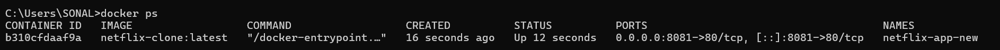
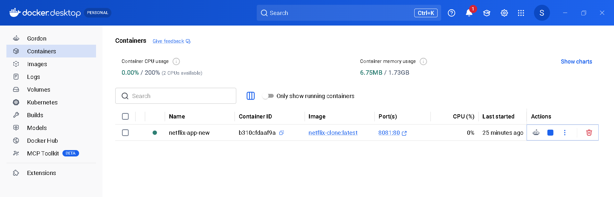
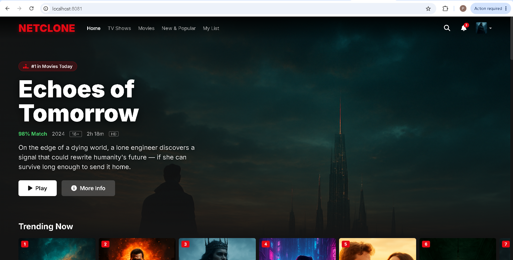
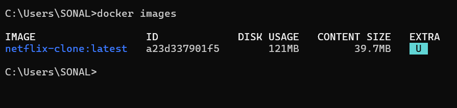

# Task 1: Netflix Clone Docker Deployment

A responsive Netflix-inspired web application containerized using Docker and deployed locally. This project demonstrates Docker fundamentals, container lifecycle management, web server deployment, and container-based application hosting.

## Features

* Netflix-style user interface
* Responsive design for desktop and mobile devices
* Docker containerization
* Nginx-based web server deployment
* Easy setup and execution
* Lightweight and portable deployment

## Technologies Used

* HTML5
* CSS3
* JavaScript
* Docker
* Nginx

## Project Structure

```text
Netflix-Clone-Docker
├── index.html
├── assets
├── css
├── js
├── Dockerfile
└── README.md
```

## Docker Commands

### Build Docker Image

```bash
docker build -t netflix-clone .
```

### Run Docker Container

```bash
docker run -d -p 8081:80 --name netflix-app netflix-clone
```

### View Running Containers

```bash
docker ps
```

### Stop Container

```bash
docker stop netflix-app
```

### Start Container

```bash
docker start netflix-app
```

## Access Application

Open your browser and visit:

```text
http://localhost:8081
```

## Learning Outcomes

* Understanding Docker containerization
* Building custom Docker images
* Deploying web applications using containers
* Managing container lifecycle
* Monitoring container status and troubleshooting issues
* Following container deployment best practices

## Screenshots

### Docker Container Running



### Docker Desktop Dashboard



### Netflix Clone in Browser



### Docker Images



## Author

Sonal Patani
Cloud Computing & DevOps Enthusiast
